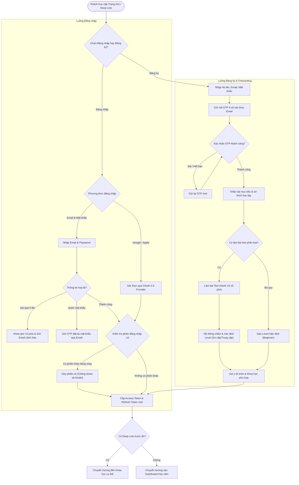

# Flow 01: Xác thực, Đăng nhập & Onboarding (Auth & Onboarding)

## 1. Thông tin chung
- **Mã luồng:** FLOW-01
- **Tên luồng:** Xác thực tài khoản, Đăng nhập Single Sign-On (SSO) & Khởi tạo lộ trình (Onboarding)
- **Tác nhân tham gia (Actors):**
  - Học viên mới / Học viên hiện tại (Student)
  - Hệ thống xác thực (Auth Service / Identity Provider)
  - Nhà cung cấp danh tính bên thứ 3 (Google OAuth, Apple ID)
- **Mục tiêu:** Cung cấp trải nghiệm đăng nhập/đăng ký liền mạch, an toàn (bảo vệ bản quyền với cơ chế Single Active Session), đồng thời cá nhân hóa trải nghiệm học tập ngay từ đầu thông qua khảo sát hoặc trắc nghiệm phân loại trình độ.

---

## 2. Tiền điều kiện (Preconditions)
- Học viên truy cập vào website thông qua thiết bị có kết nối Internet (Desktop / Mobile browser).
- Nếu đăng nhập qua Google / Apple, học viên đã có tài khoản bên thứ 3 đang hoạt động.

---

## 3. Các bước thực hiện (Happy Path)

### 3.1. Trường hợp 1: Người dùng đã có tài khoản
1. **Truy cập:** Học viên vào trang chủ hoặc bấm vào link khóa học (Deep link).
2. **Chọn Đăng nhập:** Học viên chọn phương thức:
   - Nhập `Email` + `Mật khẩu`.
   - Hoặc bấm `Tiếp tục với Google` / `Tiếp tục với Apple`.
3. **Xác thực:** Hệ thống kiểm tra thông tin đăng nhập:
   - Kiểm tra phiên đăng nhập hiện tại (Session Management). Nếu phát hiện đang đăng nhập trên thiết bị khác, hệ thống hiển thị cảnh báo và đăng xuất thiết bị cũ (chống share tài khoản học).
4. **Điều hướng:**
   - Nếu có Deep link (ví dụ bấm từ bài viết Facebook vào khóa học cụ thể): Chuyển hướng thẳng đến trang khóa học đó.
   - Nếu truy cập từ trang chủ: Chuyển hướng vào **Dashboard học viên**.

### 3.2. Trường hợp 2: Người dùng mới (Đăng ký & Onboarding)
1. **Đăng ký:**
   - Điền thông tin (Họ tên, Email, Mật khẩu $\ge 8$ ký tự có số và chữ hoa) hoặc chọn Đăng ký nhanh qua Google.
2. **Xác thực Email:**
   - Hệ thống gửi mã OTP gồm 6 chữ số qua Email (hiệu lực trong 5 phút).
   - Học viên nhập đúng OTP $\rightarrow$ Tài khoản được kích hoạt (Active).
3. **Khảo sát mục tiêu & Trắc nghiệm đầu vào (Onboarding Flow):**
   - **Bước 3a - Chọn mục tiêu:** Học viên chọn lĩnh vực quan tâm (ví dụ: Lập trình, Tiếng Anh, Thiết kế) và mục tiêu học tập (Đi làm, Lấy chứng chỉ, Khởi nghiệp).
   - **Bước 3b - Trắc nghiệm phân loại (Tùy chọn):** Học viên có thể chọn *"Làm bài test nhanh 10 phút"* để đo trình độ hoặc bấm *"Bỏ qua"*.
4. **Gợi ý lộ trình cá nhân:**
   - Dựa trên kết quả khảo sát hoặc điểm bài test, hệ thống đề xuất Lộ trình học (Learning Path) và các khóa học phù hợp nhất.
5. **Vào Dashboard:** Học viên nhận thông báo chào mừng và được dẫn vào Dashboard cá nhân.

---

## 4. Luồng nhánh & Xử lý ngoại lệ (Alternative & Exception Flows)

* **E1 - Sai mật khẩu quá 5 lần:** Hệ thống khóa tài khoản tạm thời trong 15 phút và gửi email cảnh báo bảo mật.
* **E2 - Quên mật khẩu:**
  1. Học viên bấm "Quên mật khẩu", nhập Email.
  2. Hệ thống gửi link đặt lại mật khẩu bảo mật (Magic Link / OTP có hiệu lực 15 phút).
  3. Học viên nhập mật khẩu mới và tự động đăng nhập.
* **E3 - Đăng nhập đồng thời trên nhiều thiết bị (Concurrent Sessions):**
  - Khi phát hiện token mới từ thiết bị B trong khi thiết bị A đang mở, hệ thống gửi thông báo: *"Tài khoản của bạn vừa đăng nhập ở thiết bị khác. Phiên trên thiết bị này đã kết thúc."* $\rightarrow$ Đăng xuất thiết bị A để chống share tài khoản học.
* **E4 - Bỏ qua bài test đầu vào:** Hệ thống không ép buộc; chuyển thẳng vào Dashboard và đề xuất danh mục các khóa học cơ bản nhất (Beginner).

---

## 5. Quy tắc nghiệp vụ cốt lõi (Business Rules)
1. **Độ an toàn mật khẩu:** Tối thiểu 8 ký tự, bắt buộc chứa ít nhất 1 chữ hoa, 1 chữ thường và 1 chữ số.
2. **Thời hạn Token:** Access Token (JWT) có thời hạn 30 phút, Refresh Token có thời hạn 14 ngày (lưu tại HttpOnly Cookie chống tấn công XSS).
3. **Cơ chế Single Active Session:** Mỗi tài khoản học viên chỉ được xem video/học tập trên 01 thiết bị duy nhất tại một thời điểm.

---

## 6. Sơ đồ luồng trực quan (Mermaid Flowchart)

