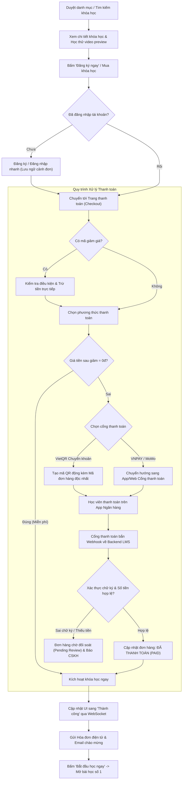

# Flow 02: Khám phá, Mua khóa học & Thanh toán (Discovery & Checkout)

## 1. Thông tin chung
- **Mã luồng:** FLOW-02
- **Tên luồng:** Khám phá danh mục, Đăng ký học thử & Thanh toán tự động (VietQR / VNPAY / MoMo)
- **Tác nhân tham gia (Actors):**
  - Học viên (Student)
  - Hệ thống Quản lý Bán hàng & Khóa học (LMS Core)
  - Cổng thanh toán / Dịch vụ ngân hàng (VietQR / SePay / VNPAY / MoMo)
  - Nhân viên Kế toán / Chăm sóc khách hàng (Support / Admin)
- **Mục tiêu:** Cung cấp trải nghiệm tìm kiếm, học thử trực quan và luồng thanh toán tự động không chạm (Zero-touch checkout), kích hoạt khóa học ngay lập tức sau khi học viên thanh toán thành công.

---

## 2. Tiền điều kiện (Preconditions)
- Khóa học đã được Giảng viên/Admin xuất bản (trạng thái `PUBLISHED`).
- Học viên có thể chưa đăng nhập khi xem thông tin, nhưng bắt buộc phải đăng nhập/đăng ký tài khoản ở bước thanh toán để gắn quyền sở hữu khóa học.

---

## 3. Các bước thực hiện (Happy Path)

### Bước 1: Khám phá & Tìm kiếm khóa học
- Học viên truy cập trang Khóa học, sử dụng thanh tìm kiếm hoặc bộ lọc:
  - Lĩnh vực (Công nghệ, Ngoại ngữ, Kinh doanh...)
  - Cấp độ (Mới bắt đầu, Trung cấp, Nâng cao)
  - Giá tiền (Miễn phí, Trả phí, Đang khuyến mãi)
  - Đánh giá sao ($\ge 4.5\star$)

### Bước 2: Xem chi tiết & Học thử (Course Preview)
- Học viên bấm vào khóa học để xem trang thông tin chi tiết:
  - Mục tiêu khóa học & Đề cương chi tiết (Curriculum).
  - Profile Giảng viên.
  - Các bài học được mở chế độ **"Học thử miễn phí" (Free Preview)**. Học viên có thể xem trực tiếp video học thử mà chưa cần mua.

### Bước 3: Đặt hàng & Áp dụng ưu đãi
- Học viên bấm **"Đăng ký ngay"** (hoặc thêm vào Giỏ hàng).
- Nếu chưa đăng nhập: Hệ thống yêu cầu đăng nhập/đăng ký nhanh (giữ nguyên ngữ cảnh giỏ hàng).
- Tại trang Checkout:
  - Nhập mã giảm giá (Coupon/Voucher nếu có).
  - Hệ thống kiểm tra tính hợp lệ của mã (hạn dùng, số lượt còn lại, giá trị đơn tối thiểu) và trừ trực tiếp vào tổng tiền thanh toán.

### Bước 4: Lựa chọn phương thức thanh toán
- Học viên chọn một trong các hình thức:
  1. **Chuyển khoản QR tự động (VietQR / SePay):** Hệ thống sinh mã QR động chứa sẵn số tài khoản, số tiền chính xác và Mã đơn hàng duy nhất trong nội dung chuyển khoản.
  2. **Ví điện tử / Thẻ nội địa (VNPAY / MoMo):** Chuyển hướng sang cổng thanh toán đối tác.

### Bước 5: Xác nhận thanh toán & Kích hoạt tự động (Instant Enrollment)
- Học viên quét mã QR và thực hiện thanh toán trên ứng dụng ngân hàng.
- Cổng thanh toán / Ngân hàng gửi **Webhook** (`payment.success`) về Backend của LMS.
- Backend kiểm tra chữ ký xác thực (HMAC Signature), đối soát số tiền và mã đơn hàng:
  - Cập nhật trạng thái đơn hàng sang `PAID`.
  - Tự động tạo bản ghi ghi danh (`Enrollment`) cho học viên.
- Màn hình thanh toán trên trình duyệt của học viên tự động nhảy sang thông báo **"Thanh toán thành công"** (thông qua WebSocket / Server-Sent Events).
- Gửi hóa đơn điện tử và hướng dẫn học tập về Email của học viên.
- Học viên bấm **"Vào học ngay"** để chuyển thẳng tới bài học đầu tiên.

---

## 4. Luồng nhánh & Xử lý ngoại lệ (Alternative & Exception Flows)

* **E1 - Khóa học Miễn phí ($0đ):** Bỏ qua bước thanh toán ngân hàng; hệ thống kích hoạt Enrollment ngay lập tức khi bấm "Đăng ký học".
* **E2 - Hết hạn thanh toán (Quá 15 phút):** Đơn hàng tự động chuyển sang trạng thái `EXPIRED`. Mã giảm giá đã áp dụng được hoàn lại cho học viên.
* **E3 - Chuyển khoản sai nội dung hoặc thiếu tiền:**
  - Tiền đã trừ từ tài khoản ngân hàng nhưng Webhook báo lệch tiền hoặc sai cú pháp mã đơn.
  - Hệ thống đưa đơn hàng vào trạng thái `PENDING_REVIEW` (Chờ đối soát thủ công).
  - Giao diện hiển thị nút: *"Tôi đã chuyển khoản nhưng chưa nhận được khóa học"* kèm hướng dẫn tải ảnh chụp biên lai giao dịch để đội ngũ CSKH hỗ trợ kích hoạt thủ công trong 15 phút.
* **E4 - Chính sách hoàn tiền (Refund Policy):** Học viên có quyền yêu cầu hoàn tiền trong vòng 7 ngày nếu thời lượng đã học chưa vượt quá 20% và chưa làm bài kiểm tra cuối khóa.

---

## 5. Quy tắc nghiệp vụ (Business Rules)
1. **Khóa học trọn đời / Có thời hạn:** Mỗi khóa học có thể cấu hình truy cập trọn đời (Lifetime) hoặc có thời hạn (ví dụ: 365 ngày). Hệ thống tự động tính ngày hết hạn dựa trên ngày kích hoạt đơn hàng.
2. **Bảo mật Webhook:** Bắt buộc kiểm tra chữ ký HMAC-SHA256 trên Webhook nhận từ Cổng thanh toán để chống giả mạo giao dịch.
3. **Idempotency:** Mỗi mã giao dịch thanh toán chỉ được xử lý kích hoạt duy nhất 01 lần để tránh lỗi duplicate enrollment.

---

## 6. Sơ đồ luồng trực quan (Mermaid Flowchart)

