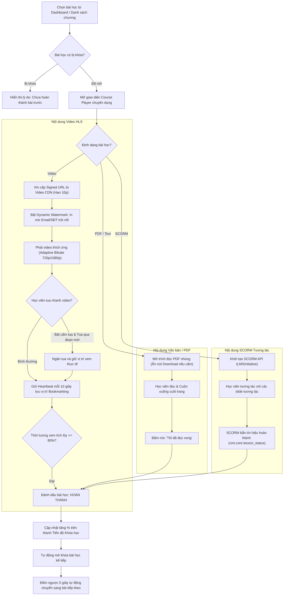

# Flow 03: Trải nghiệm Học tập đa phương tiện & Lưu vết Tiến độ (Multi-format Learning & Progress Tracking)

## 1. Thông tin chung
- **Mã luồng:** FLOW-03
- **Tên luồng:** Trình phát bài giảng đa định dạng, Bảo vệ bản quyền & Đồng bộ tiến độ học tập
- **Tác nhân tham gia (Actors):**
  - Học viên (Student)
  - Trình phát bài giảng (LMS Course Player)
  - Hệ thống phân phối Video chuyên dụng (Video CDN / Transcoder - Bunny/Cloudflare)
  - SCORM Runtime Engine
  - Dịch vụ đồng bộ tiến độ (Progress & Bookmarking Service)
- **Mục tiêu:** Đảm bảo trải nghiệm học tập mượt mà trên đa dạng thiết bị, hỗ trợ nhiều định dạng nội dung (Video HLS, PDF, SCORM), chống vi phạm bản quyền và lưu vết chính xác tiến độ học tập theo thời gian thực.

---

## 2. Tiền điều kiện (Preconditions)
- Học viên đã ghi danh vào khóa học (trạng thái `ENROLLED`).
- Bài học đã được mở khóa (học theo trình tự hoặc học tự do tùy cấu hình khóa).

---

## 3. Các bước thực hiện (Happy Path)

### Bước 1: Truy cập Trình phát học tập (Course Player)
- Học viên vào Dashboard, chọn khóa học $\rightarrow$ Hệ thống mở giao diện học tập chuyên dụng:
  - Cột bên phải: Cây danh mục Chương/Bài học, kèm biểu tượng trạng thái (Đã xong, Đang học, Bị khóa).
  - Vùng trung tâm: Trình phát nội dung đa phương tiện.
  - Thanh trên cùng: Tiến độ tổng quan (% hoàn thành) và nút Quay lại Dashboard.

### Bước 2: Nhận diện và Xử lý theo định dạng bài học

#### A. Định dạng Video chất lượng cao (HLS Video):
1. Hệ thống cấp **Signed URL** bảo mật (thời hạn 10 phút) từ Video CDN.
2. Trình phát hỗ trợ phát thích ứng theo tốc độ mạng (Adaptive Bitrate HLS: 360p, 720p, 1080p, 2K/4K).
3. **Bảo vệ bản quyền (Anti-piracy):**
   - **Dynamic Watermarking:** Tự động hiển thị Email & SĐT của học viên mờ mờ, di chuyển ngẫu nhiên trên khung video mỗi 30 giây để ngăn quay lén màn hình.
   - Vô hiệu hóa chuột phải tải file gốc và phím tắt F12 cơ bản.
4. **Quy tắc hoàn thành:** Học viên phải xem tích lũy $\ge 80\%$ thời lượng thực tế của video. Nếu khóa học bật chế độ *"Nghiêm ngặt (Strict Mode)"*, học viên không thể kéo thanh thời gian (seek bar) qua các đoạn chưa từng xem.

#### B. Định dạng Văn bản / Tài liệu PDF:
1. Hiển thị PDF trực tiếp trên trình đọc tích hợp (PDF Viewer).
2. Tắt nút Download nếu giảng viên cấu hình chỉ cho phép đọc trực tuyến.
3. Học viên cuộn xuống hết tài liệu và bấm nút *"Đánh dấu đã hoàn thành"*.

#### C. Định dạng Slide tương tác SCORM (1.2 / 2004):
1. Hệ thống nạp gói SCORM vào iframe độc lập và khởi tạo kết nối SCORM API (`LMSInitialize`).
2. Học viên tương tác với các slide tương tác.
3. Khi hoàn tất gói slide, SCORM gửi lệnh `LMSSetValue('cmi.core.lesson_status', 'completed')` và đóng kết nối `LMSFinish`.

### Bước 3: Đồng bộ vị trí học (Heartbeat & Bookmarking)
- Định kỳ mỗi **10 giây**, trình phát gửi một gói tin Heartbeat về máy chủ:
  - Ghi nhận giây hiện tại (`last_watched_second`).
  - Ghi nhận tổng thời gian đã tích lũy (`watched_seconds`).
- Khi học viên tạm dừng hoặc thoát trình duyệt, lần sau vào lại, hệ thống hiển thị thông báo: *"Tiếp tục xem từ phút 06:15?"* kèm nút bấm nhảy thẳng đến vị trí dở dang.

### Bước 4: Mở khóa bài học kế tiếp (Progression & Gating)
- Khi bài học thỏa mãn điều kiện hoàn thành $\rightarrow$ Hệ thống cập nhật trạng thái bài sang `COMPLETED`.
- Tự động mở khóa bài học tiếp theo (nếu học theo chế độ Tuần tự - Sequential).
- Cập nhật tăng % trên thanh tiến độ tổng thể của khóa học.
- Tự động chuyển bài sau 5 giây (Auto-play next lesson) kèm nút Hủy nếu muốn ở lại ôn tập.

---

## 4. Luồng nhánh & Xử lý ngoại lệ (Alternative & Exception Flows)

* **E1 - Mất kết nối Internet khi đang học:**
  - Player tạm thời lưu vị trí vào bộ nhớ cục bộ trình duyệt (`localStorage`).
  - Khi có mạng trở lại, Player tự động gửi gói đồng bộ bù lên máy chủ mà không làm gián đoạn học viên.
* **E2 - Bài học tiếp theo bị khóa (Gated Content):**
  - Nếu học viên bấm vào bài bị khóa, hệ thống hiển thị tooltip giải thích: *"Bạn cần hoàn thành bài học [Tên bài trước] hoặc vượt qua bài kiểm tra để mở bài này"*.
* **E3 - Đăng nhập đồng thời khi đang phát video:**
  - Nếu tài khoản được mở và xem video trên thiết bị khác, video tại thiết bị hiện tại sẽ ngay lập tức tạm dừng và hiển thị thông báo: *"Tài khoản của bạn đang được phát trên thiết bị khác"*.

---

## 5. Quy tắc nghiệp vụ (Business Rules)
1. **Tiêu chuẩn tính hoàn thành video:** Mặc định xem đủ $\ge 80\%$ thời lượng. Giảng viên có thể tùy chỉnh ngưỡng này từ 70% đến 100%.
2. **Thời hạn URL video:** Signed URL có thời hạn tối đa 10 phút; Player tự động xin token mới trong nền (Background Token Refresh) để không gián đoạn video dài 1-2 tiếng.
3. **Cơ chế Chống tua:** Có thể bật/tắt theo từng bài học (ví dụ: bài giảng bắt buộc thì cấm tua, bài tài liệu tham khảo thì cho tua tự do).

---

## 6. Sơ đồ luồng trực quan (Mermaid Flowchart)

