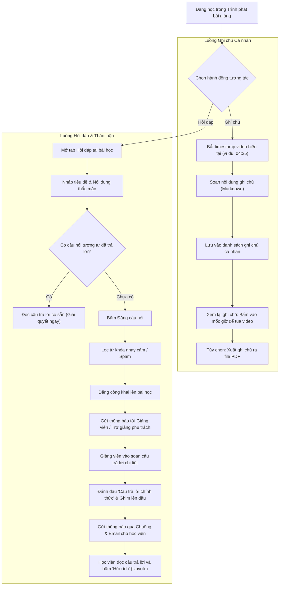

# Flow 04: Tương tác Bài học, Ghi chú & Hỏi đáp (Q&A & Note-taking)

## 1. Thông tin chung
- **Mã luồng:** FLOW-04
- **Tên luồng:** Ghi chú cá nhân gắn nhãn thời gian (Timestamped Notes) & Hỏi đáp tương tác bài giảng (Q&A)
- **Tác nhân tham gia (Actors):**
  - Học viên (Student)
  - Giảng viên & Trợ giảng (Instructor & Teaching Assistant - TA)
  - Hệ thống Quản lý Thảo luận & Thông báo (Community & Notification Service)
- **Mục tiêu:** Nâng cao tỷ lệ hoàn thành khóa học và mức độ gắn kết của học viên thông qua công cụ ghi chú thông minh theo thời gian thực và kênh trao đổi, giải đáp trực tiếp với người dạy.

---

## 2. Tiền điều kiện (Preconditions)
- Học viên đang ở giao diện Trình phát bài giảng (Course Player).
- Khóa học có mở tính năng Thảo luận / Hỏi đáp (mặc định bật).

---

## 3. Các bước thực hiện (Happy Path)

### Phân nhánh A: Ghi chú cá nhân thông minh (Timestamped Notes)
1. **Tạo ghi chú:** Khi đang xem video tại một mốc cụ thể (ví dụ: `04:25`), học viên bấm tổ hợp phím tắt hoặc nút *"Thêm ghi chú"*.
2. **Ghi nhận mốc thời gian:** Hệ thống tự động gắn thẻ thời gian `[04:25]` vào đầu nội dung ghi chú.
3. **Soạn thảo & Lưu:** Học viên nhập nội dung (hỗ trợ văn bản phong phú, Markdown) và bấm Lưu.
4. **Xem lại & Ôn tập:**
   - Trong tab "Ghi chú của tôi", toàn bộ các ghi chú được liệt kê theo thứ tự thời gian.
   - Khi bấm vào mốc thời gian `[04:25]`, trình phát video tự động nhảy ngay đến giây đó.
   - Học viên có thể tải toàn bộ ghi chú của khóa học về máy dưới dạng file PDF/Markdown.

### Phân nhánh B: Hỏi đáp & Trao đổi bài giảng (Q&A Community)
1. **Gửi câu hỏi:**
   - Học viên chuyển sang tab *"Hỏi đáp / Thảo luận"*.
   - Nhập tiêu đề và chi tiết câu hỏi (tùy chọn đính kèm mốc thời gian video hiện tại và ảnh chụp màn hình).
   - Trước khi gửi, hệ thống tự động tìm kiếm và gợi ý các câu hỏi tương tự đã có câu trả lời.
   - Học viên bấm *"Đăng câu hỏi"*.
2. **Tiếp nhận & Thông báo cho Giảng viên:**
   - Hệ thống hiển thị câu hỏi trong danh sách thảo luận của bài học.
   - Gửi thông báo đến trang Quản trị của Giảng viên/Trợ giảng phụ trách khóa học.
3. **Giảng viên phản hồi:**
   - Giảng viên/Trợ giảng soạn thảo câu trả lời (hỗ trợ chèn code, công thức toán LaTeX, hình ảnh).
   - Giảng viên có thể đánh dấu:
     - **"Câu trả lời chính thức" (Verified Answer)**
     - **"Ghim lên đầu" (Pinned)** cho các câu hỏi phổ biến.
4. **Học viên nhận thông báo:**
   - Hệ thống bắn thông báo tức thời qua quả chuông trên web và gửi email nhắc nhở học viên.
   - Học viên bấm vào thông báo $\rightarrow$ Hệ thống cuộn trang và làm sáng (highlight) câu trả lời của giảng viên.
   - Học viên có thể bấm "Hữu ích" (Upvote) hoặc phản hồi tiếp (Thread reply).

---

## 4. Luồng nhánh & Xử lý ngoại lệ (Alternative & Exception Flows)

* **E1 - Câu hỏi bị trùng lặp (Duplicate Questions):** Hệ thống hiển thị box gợi ý: *"Đã có 3 câu hỏi tương tự với vấn đề này. Bạn có muốn xem câu trả lời trước không?"* giúp học viên giải quyết vấn đề ngay mà không cần chờ.
* **E2 - Báo cáo vi phạm & Kiểm duyệt (Moderation):**
  - Học viên hoặc trợ giảng có thể bấm nút "Báo cáo" (Report) với các bình luận xúc phạm, spam hoặc chia sẻ tài liệu lậu.
  - Bình luận bị báo cáo sẽ tự động ẩn và chuyển vào danh sách chờ Admin kiểm duyệt xử lý.
* **E3 - Giảng viên chậm phản hồi (SLA Quá hạn):**
  - Nếu sau 24 giờ kể từ khi câu hỏi được tạo mà chưa có phản hồi từ Giảng viên/Trợ giảng, hệ thống tự động nâng cờ ưu tiên (High Priority) và gửi email nhắc nhở Giảng viên phụ trách.

---

## 5. Quy tắc nghiệp vụ (Business Rules)
1. **Quyền riêng tư ghi chú:** Ghi chú cá nhân là dữ liệu tuyệt mật của học viên, người khác và giảng viên không thể xem được.
2. **Gắn quyền người trả lời:** Phản hồi từ Giảng viên hoặc Trợ giảng bắt buộc có huy hiệu nhận diện rõ ràng (ví dụ: `[Giảng viên]`, `[Trợ giảng]`) để học viên phân biệt với phản hồi của các bạn học khác.
3. **Bộ lọc ngôn từ:** Tự động lọc các từ khóa thô tục hoặc spam link độc hại trước khi bài viết được hiển thị công khai.

---

## 6. Sơ đồ luồng trực quan (Mermaid Flowchart)

