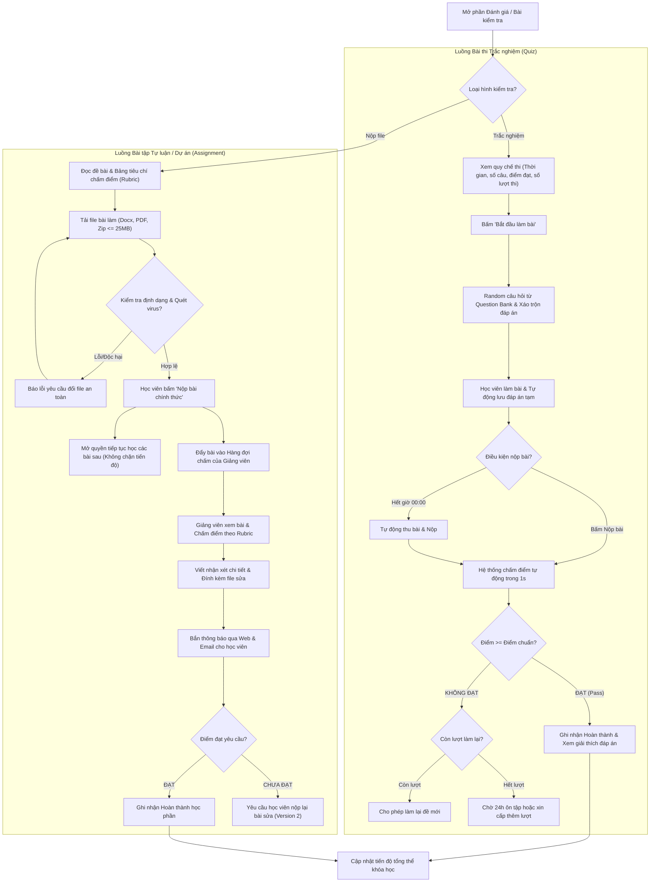

# Flow 05: Kiểm tra, Đánh giá & Chấm điểm (Assessment & Grading Flow)

## 1. Thông tin chung
- **Mã luồng:** FLOW-05
- **Tên luồng:** Làm bài kiểm tra trắc nghiệm, Nộp bài tập thực hành & Quy trình chấm điểm
- **Tác nhân tham gia (Actors):**
  - Học viên (Student)
  - Hệ thống chấm thi tự động (Auto-Grading Engine)
  - Giảng viên & Trợ giảng chấm bài (Instructor / TA Grader)
- **Mục tiêu:** Đánh giá chính xác năng lực người học thông qua hai hình thức: trắc nghiệm chấm tự động tức thời và bài tập tự luận/dự án thực hành có phản hồi chi tiết từ giảng viên mà không làm tắc nghẽn tiến độ học tập (Non-blocking progression).

---

## 2. Tiền điều kiện (Preconditions)
- Học viên đã hoàn thành các bài học tiên quyết dẫn đến bài kiểm tra.
- Bài kiểm tra đang trong thời hạn mở (nếu có hạn chót - Due date).

---

## 3. Các bước thực hiện (Happy Path)

### Phân nhánh 1: Bài kiểm tra trắc nghiệm tự động (Online Quiz)
1. **Màn hình chuẩn bị:** Hiển thị thông số bài thi:
   - Số lượng câu hỏi (ví dụ: 20 câu).
   - Thời gian làm bài (ví dụ: 30 phút).
   - Điểm đạt tối thiểu (ví dụ: $80\%$).
   - Số lượt làm lại cho phép (ví dụ: tối đa 3 lần).
2. **Làm bài:**
   - Hệ thống bốc ngẫu nhiên câu hỏi từ Ngân hàng đề (Question Bank), xáo trộn thứ tự câu và thứ tự đáp án (A, B, C, D).
   - Đồng hồ đếm ngược (Countdown Timer) hiển thị liên tục.
   - Trình duyệt tự động lưu tạm đáp án mỗi khi chọn câu (Auto-save).
3. **Nộp bài:**
   - Học viên chủ động bấm *"Nộp bài"* hoặc hệ thống **tự động nộp bài khi đồng hồ về 00:00**.
4. **Chấm điểm & Phản hồi:**
   - Hệ thống tính điểm ngay lập tức trong 1 giây.
   - Hiển thị kết quả: Số điểm đạt được, trạng thái `ĐẠT (PASS)` hoặc `CHƯA ĐẠT (FAIL)`.
   - Hiển thị bảng giải thích đáp án chi tiết và các lỗ hổng kiến thức cần ôn tập lại.

### Phân nhánh 2: Bài tập thực hành & Dự án nộp file (Assignment / Project)
1. **Đọc đề bài & Tiêu chí:**
   - Học viên tải tài liệu đề bài, xem bảng tiêu chí chấm điểm chi tiết (Grading Rubric).
2. **Tải lên bài làm (File Submission):**
   - Học viên đính kèm file bài làm (`.docx`, `.pdf`, `.zip`, dung lượng $\le 25\text{ MB}$).
   - Hệ thống quét mã độc và kiểm tra định dạng hợp lệ.
   - Học viên ghi chú thêm cho giảng viên và bấm *"Xác nhận nộp bài"*.
3. **Giải tỏa tắc nghẽn (Non-blocking Progression):**
   - Trạng thái bài tập chuyển sang `WAITING_FOR_GRADE` (Đang chờ chấm).
   - **Quy tắc quan trọng:** Học viên **vẫn được phép tiếp tục học các bài học tiếp theo** trong lúc chờ giảng viên chấm (thời hạn chấm tối đa 48 giờ), tránh việc học viên bị đứng yên gián đoạn lộ trình học.
4. **Giảng viên chấm bài:**
   - Giảng viên/Trợ giảng truy cập *Hàng đợi chấm bài (Grading Queue)*.
   - Xem preview file trực tiếp hoặc tải file về.
   - Nhập điểm theo từng tiêu chuẩn Rubric và viết nhận xét chi tiết (Feedback + đính kèm file sửa nếu có).
   - Bấm *"Hoàn tất chấm bài"*.
5. **Trả kết quả:**
   - Hệ thống gửi thông báo và email: *"Bài tập của bạn đã được Giảng viên chấm điểm!"*.
   - Học viên xem chi tiết điểm số và lời nhận xét.

---

## 4. Luồng nhánh & Xử lý ngoại lệ (Alternative & Exception Flows)

* **E1 - Không đạt bài trắc nghiệm (Fail Quiz):**
  - Nếu còn lượt làm lại: Học viên có thể bấm *"Làm lại bài"* (đề mới sẽ được xáo trộn lại).
  - Nếu hết lượt: Khóa bài thi trong 24 giờ (Cooldown period) để học viên ôn tập lại bài giảng trước khi được mở thêm lượt, hoặc cần gửi yêu cầu cho Giảng viên cấp thêm quyền thi.
* **E2 - Mất mạng hoặc vô tình đóng trình duyệt khi đang thi trắc nghiệm:**
  - Đồng hồ đếm ngược trên server vẫn tiếp tục chạy.
  - Khi học viên mở lại trang web, các đáp án đã chọn trước đó được khôi phục nguyên vẹn và học viên tiếp tục làm bài cho đến khi hết giờ.
* **E3 - Không đạt bài nộp tự luận (Fail Assignment):**
  - Giảng viên đánh dấu `YÊU CẦU NỘP LẠI (RESUBMIT)` kèm hướng dẫn sửa chữa.
  - Học viên chỉnh sửa file và tải lên bản nộp lần 2 (Version 2).

---

## 5. Quy tắc nghiệp vụ (Business Rules)
1. **Tính điểm bài làm lại:** Nếu học viên làm trắc nghiệm nhiều lần, hệ thống sẽ lấy **Điểm cao nhất (Highest Attempt)** làm điểm ghi nhận chính thức.
2. **Bảo mật đề thi:** Ngăn chặn bôi đen sao chép văn bản (Copy-paste disabled) trong lúc làm bài trắc nghiệm để hạn chế tra cứu đáp án bên ngoài.
3. **Giới hạn nộp file:** File tải lên bắt buộc phải qua bước xác thực MIME type và quét virus tự động trước khi lưu vào Object Storage (S3 / Cloudflare R2).

---

## 6. Sơ đồ luồng trực quan (Mermaid Flowchart)

