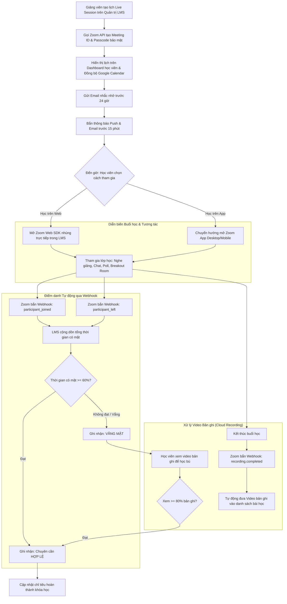

# Flow 06: Lớp học Trực tuyến & Điểm danh Tự động (Live Sessions & Attendance Tracking)

## 1. Thông tin chung
- **Mã luồng:** FLOW-06
- **Tên luồng:** Lên lịch, Tham gia Lớp học trực tuyến (Zoom / Google Meet) & Điểm danh tự động qua Webhook
- **Tác nhân tham gia (Actors):**
  - Học viên (Student)
  - Giảng viên chủ trì (Host Instructor)
  - Hệ thống Quản lý Đào tạo (LMS Backend)
  - Nền tảng Hội nghị Trực tuyến bên thứ 3 (Zoom Meeting API / Web SDK / Google Meet)
- **Mục tiêu:** Tổ chức các buổi học trực tuyến tương tác cao theo lịch trình, nhắc hẹn tự động, cho phép học trực tiếp ngay trên giao diện web hoặc ứng dụng ngoài, đồng thời tự động hóa hoàn toàn khâu điểm danh và lưu trữ video bản ghi (Recording).

---

## 2. Tiền điều kiện (Preconditions)
- Giảng viên đã tạo lịch buổi Live và liên kết tài khoản Zoom/Google Meet vào hệ thống.
- Học viên đã đăng ký khóa học có chứa học phần Live Session.

---

## 3. Các bước thực hiện (Happy Path)

### Bước 1: Lên lịch & Đồng bộ phòng học
1. Giảng viên tạo buổi Live trong trang quản trị: Nhập Tiêu đề, Thời gian bắt đầu, Thời lượng dự kiến (ví dụ: 90 phút), và Mô tả nội dung.
2. Hệ thống LMS tự động gọi **Zoom API (Server-to-Server OAuth)** để tạo phòng họp, thiết lập mật khẩu và các tùy chọn bảo mật (chặn vẽ bậy, tắt mic học viên khi vào phòng).
3. Buổi Live xuất hiện trên Lịch học của học viên kèm nút *"Thêm vào Google Calendar / Outlook"*.

### Bước 2: Nhắc hẹn đa kênh (Automated Reminders)
- **Trước 24 giờ:** Hệ thống gửi Email nhắc nhở học viên chuẩn bị bài trước buổi học.
- **Trước 15 phút:** Bắn thông báo đẩy trên trình duyệt/ứng dụng (Push Notification) và Email có nút *"Vào phòng học ngay"*.

### Bước 3: Tham gia buổi học (Join Class)
- Khi đến giờ học, nút *"Tham gia phòng học"* trên Dashboard chuyển sang màu xanh nổi bật.
- Học viên bấm vào và lựa chọn hình thức:
  - **Học trực tiếp trên Web:** Sử dụng **Zoom Web Meeting SDK** tích hợp sẵn ngay trong tab học tập của LMS, không cần cài đặt phần mềm Zoom riêng.
  - **Mở ứng dụng ngoài:** Mở ứng dụng Zoom Desktop / Mobile App thông qua Deep Link URL.

### Bước 4: Tương tác trong buổi học
- Học viên nghe giảng, tương tác âm thanh/video, chat đặt câu hỏi, tham gia chia nhóm thảo luận (Breakout Rooms) và làm bài thăm dò (Poll).

### Bước 5: Điểm danh tự động qua Webhook (Zero-touch Attendance)
- Nền tảng Zoom tự động gửi sự kiện Webhook về máy chủ LMS:
  - `meeting.participant_joined`: Ghi nhận thời điểm học viên bắt đầu vào phòng.
  - `meeting.participant_left`: Ghi nhận thời điểm học viên rời phòng.
- LMS tính tổng thời gian tham gia thực tế:
  - Nếu học viên có mặt **$\ge 60\%$ tổng thời lượng buổi Live** $\rightarrow$ Hệ thống tự động ghi nhận trạng thái: `ĐÃ THAM GIA ĐẠT CHUẨN (ATTENDED)`.
  - Cập nhật chỉ tiêu chuyên cần vào điều kiện tốt nghiệp của khóa học.

### Bước 6: Tự động lưu bản ghi xem lại (Cloud Recording Playback)
- Khi buổi học kết thúc, Zoom xử lý video lưu trữ đám mây và bắn Webhook `recording.completed` về LMS.
- LMS tự động lấy link video bản ghi, đưa vào mục *"Xem lại buổi học Live"* trong danh sách bài học để học viên có thể ôn tập bất cứ lúc nào.

---

## 4. Luồng nhánh & Xử lý ngoại lệ (Alternative & Exception Flows)

* **E1 - Học viên vắng mặt buổi Live (Học bù qua bản ghi):**
  - Trạng thái chuyên cần hiển thị `VẮNG MẶT (ABSENT)`.
  - Hệ thống cho phép học viên **học bù bằng cách xem video bản ghi**: Nếu học viên xem $\ge 80\%$ thời lượng video bản ghi, hệ thống sẽ gỡ trạng thái vắng và cộng điểm hoàn thành bù.
* **E2 - Giảng viên dời lịch hoặc hủy buổi học:**
  - Giảng viên cập nhật lại thời gian trong trang quản trị.
  - LMS ngay lập tức gửi email và tin nhắn thông báo khẩn cho toàn bộ học viên lớp học, đồng thời tự động cập nhật lại sự kiện trên Google Calendar đã đồng bộ.
* **E3 - Mất kết nối giữa chừng:**
  - Nếu học viên bị rớt mạng và vào lại nhiều lần, Webhook của Zoom vẫn ghi nhận đầy đủ các mốc `joined` và `left` để cộng dồn tổng số phút có mặt.

---

## 5. Quy tắc nghiệp vụ (Business Rules)
1. **Tiêu chuẩn tính chuyên cần:** Mặc định có mặt tối thiểu 60% thời lượng buổi học (ví dụ: buổi học 90 phút cần có mặt ít nhất 54 phút). Giảng viên có thể điều chỉnh tỷ lệ này.
2. **Bảo mật phòng học:** Chỉ những học viên đã đăng ký khóa học và có tài khoản hợp lệ mới được cấp Signature/Token để vào phòng học, ngăn chặn người lạ xâm nhập quấy rối (Zoom bombing).
3. **Thời hạn lưu trữ bản ghi:** Video bản ghi trên Cloud Recording được lưu trữ trọn đời khóa học hoặc tối thiểu 180 ngày.

---

## 6. Sơ đồ luồng trực quan (Mermaid Flowchart)

