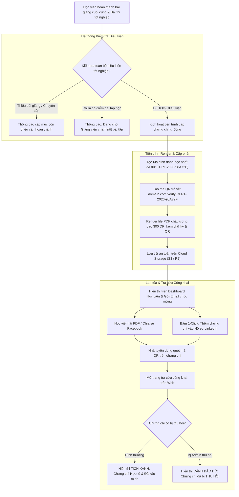

# Flow 07: Cấp phát, Tra cứu & Xác thực Chứng chỉ (Certification & Public Verification)

## 1. Thông tin chung
- **Mã luồng:** FLOW-07
- **Tên luồng:** Kiểm tra điều kiện tốt nghiệp, Render chứng chỉ điện tử PDF kèm QR code & Trang tra cứu công khai (Public Verification)
- **Tác nhân tham gia (Actors):**
  - Học viên (Student)
  - Hệ thống cấp chứng chỉ (Certificate Engine)
  - Nhà tuyển dụng / Đối tác kiểm tra bằng cấp (Public Verifier)
  - Quản trị viên hệ thống (Admin)
- **Mục tiêu:** Tự động hóa 100% quy trình cấp chứng chỉ khi học viên đạt chuẩn đào tạo, đảm bảo tính pháp lý và chống làm giả bằng mã định danh duy nhất và trang xác thực công khai, hỗ trợ học viên chia sẻ lên LinkedIn và mạng xã hội.

---

## 2. Tiền điều kiện (Preconditions)
- Khóa học có cấu hình chính sách cấp chứng chỉ (Certificate Enabled).
- Học viên đã hoàn thành toàn bộ học phần trong khóa học.

---

## 3. Các bước thực hiện (Happy Path)

### Bước 1: Kiểm tra tổng thể điều kiện tốt nghiệp
Hệ thống tự động kích hoạt tiến trình kiểm tra (Audit Checklist):
1. **Tiến độ bài giảng:** Đạt $100\%$ các bài học (Video, PDF, SCORM).
2. **Bài tập thực hành:** Toàn bộ các bài Assignment nộp file đã được Giảng viên chấm điểm và đạt $\ge$ điểm chuẩn.
3. **Chuyên cần Live Session:** Đã tham gia $\ge 60\%$ thời lượng hoặc đã xem bù video bản ghi $\ge 80\%$.
4. **Bài thi cuối khóa (Final Exam):** Đạt điểm thi tốt nghiệp theo quy định (ví dụ: $\ge 80/100$).

### Bước 2: Sinh chứng chỉ điện tử an toàn (Generate Secure Certificate)
1. **Tạo mã định danh duy nhất:** Hệ thống sinh mã `Certificate Code` (ví dụ: `CERT-2026-98A72F`) và mã băm toàn vẹn (SHA-256 Hash).
2. **Tạo mã QR xác thực:** Gắn đường dẫn công khai tra cứu: `https://ten-mien.com/verify/CERT-2026-98A72F`.
3. **Render PDF Vector chất lượng cao (300 DPI):**
   - Tên học viên (tự động chuẩn hóa chữ hoa).
   - Tên khóa học & Giảng viên phụ trách.
   - Ngày cấp và ngày hết hạn (nếu có).
   - Con dấu và Chữ ký điện tử của Giám đốc đào tạo / Giảng viên.
   - Mã QR xác thực đặt ở góc trang trọng của chứng chỉ.

### Bước 3: Phát hành & Lan tỏa thành tích
1. **Chúc mừng & Cung cấp chứng chỉ:**
   - Trên Dashboard của học viên xuất hiện hiệu ứng chúc mừng (Confetti) và nút *"Nhận chứng chỉ"*.
   - Gửi Email chúc mừng tốt nghiệp đính kèm file PDF chứng chỉ gốc.
2. **Tích hợp 1-Click thêm vào LinkedIn:**
   - Học viên bấm *"Thêm vào hồ sơ LinkedIn" (Add to LinkedIn)* $\rightarrow$ Hệ thống tự động điền sẵn Tên chứng chỉ, Tổ chức cấp bằng, Ngày cấp và Link xác thực vào hồ sơ LinkedIn của học viên.
3. **Tải về & Chia sẻ:** Hỗ trợ tải file PDF chất lượng in ấn hoặc chia sẻ ảnh lên Facebook.

### Bước 4: Trang tra cứu & Xác minh công khai (Public Verification Page)
- Khi Nhà tuyển dụng hoặc bất kỳ ai quét mã QR trên chứng chỉ giấy/ảnh:
  - Trình duyệt mở trang web xác thực công khai: `domain.com/verify/[Mã_chứng_chỉ]`.
  - Hiển thị dấu tích xanh: **"CHỨNG CHỈ HỢP LỆ VÀ ĐÃ ĐƯỢC XÁC MINH"**.
  - Liệt kê đầy đủ thông tin: Người nhận, Khóa học, Ngày hoàn thành, Kỹ năng đã đạt được, Đơn vị cấp bằng.

---

## 4. Luồng nhánh & Xử lý ngoại lệ (Alternative & Exception Flows)

* **E1 - Thu hồi chứng chỉ (Certificate Revocation):**
  - Trong trường hợp học viên bị phát hiện gian lận thi cử, sao chép mã nguồn đồ án, hoặc yêu cầu hoàn tiền khóa học sau khi nhận bằng:
  - Admin thực hiện thao tác **"Thu hồi chứng chỉ" (Revoke)** trên trang Quản trị, nhập lý do thu hồi.
  - Ngay lập tức, trang xác thực công khai chuyển sang trạng thái cảnh báo đỏ: **"CẢNH BÁO: CHỨNG CHỈ NÀY ĐÃ BỊ THU HỒI VÀO NGÀY [DD/MM/YYYY]"** kèm lý do, bảo vệ tuyệt đối uy tín của tổ chức đào tạo.
* **E2 - Học viên yêu cầu đổi tên trên chứng chỉ:**
  - Nếu tên học viên bị sai chính tả so với CCCD/Hộ chiếu: Học viên gửi yêu cầu chỉnh sửa hồ sơ.
  - Admin phê duyệt $\rightarrow$ Hệ thống tự động hủy chứng chỉ cũ và re-render chứng chỉ mới với mã phiên bản cập nhật.

---

## 5. Quy tắc nghiệp vụ (Business Rules)
1. **Không thể giả mạo:** Mã chứng chỉ là chuỗi ngẫu nhiên duy nhất trong cơ sở dữ liệu, không thể tự bịa đặt.
2. **Trang xác thực mở (Public):** Trang `verify` không yêu cầu đăng nhập, đảm bảo nhà tuyển dụng có thể kiểm chứng trong 3 giây.
3. **Độ phân giải:** File PDF xuất ra bắt buộc ở định dạng Vector/300 DPI để học viên có thể mang ra tiệm in ấn chất lượng cao làm hồ sơ xin việc.

---

## 6. Sơ đồ luồng trực quan (Mermaid Flowchart)

