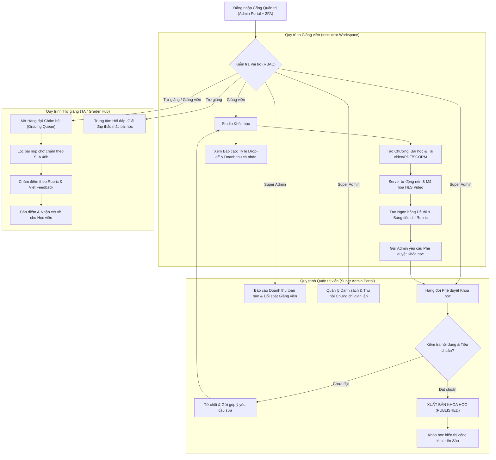

# Flow 08: Quản trị Hệ thống & Không gian Giảng viên (Admin & Instructor Operations)

## 1. Thông tin chung
- **Mã luồng:** FLOW-08
- **Tên luồng:** Phân quyền vai trò (RBAC), Vòng đời khóa học, Hàng đợi chấm bài & Báo cáo phân tích chuyên sâu
- **Tác nhân tham gia (Actors):**
  - Quản trị viên hệ thống (Super Admin)
  - Giảng viên (Instructor)
  - Trợ giảng (Teaching Assistant - TA)
  - Hệ thống Quản trị Trung tâm (LMS Admin Portal)
- **Mục tiêu:** Cung cấp không gian làm việc chuyên nghiệp, phân định rành mạch quyền hạn giữa Admin và Giảng viên, tối ưu hóa quy trình kiểm duyệt xuất bản khóa học, hỗ trợ chấm bài tập trung và cung cấp số liệu phân tích kinh doanh - đào tạo trực quan.

---

## 2. Tiền điều kiện (Preconditions)
- Người dùng có tài khoản đã được cấp quyền quản trị (Role: `ADMIN`, `INSTRUCTOR`, hoặc `TEACHING_ASSISTANT`).
- Đăng nhập qua cổng quản trị an toàn (hỗ trợ bảo mật 2 lớp - 2FA).

---

## 3. Các bước thực hiện (Happy Path)

### Phân hệ 1: Quản trị Vòng đời Khóa học (Course Lifecycle Management)
1. **Khởi tạo Bản nháp (Draft):**
   - Giảng viên tạo khung chương trình: Các Chương (Sections) và Bài học (Lessons).
   - Đăng tải nội dung: Tải lên video gốc (hệ thống tự động kích hoạt tiến trình nén và mã hóa HLS), tải tài liệu PDF, bài tập SCORM.
   - Thiết lập bài kiểm tra: Tạo ngân hàng câu hỏi, chọn câu hỏi trắc nghiệm, cấu hình tiêu chí chấm bài tự luận (Rubric).
   - Thiết lập giá bán, video học thử (Free Preview) và chính sách cấp chứng chỉ.
2. **Gửi phê duyệt (Submit for Review):**
   - Sau khi hoàn thiện, Giảng viên bấm *"Gửi phê duyệt"*. Khóa học chuyển sang trạng thái `PENDING_REVIEW`.
3. **Kiểm duyệt & Xuất bản (Admin Review & Publish):**
   - Super Admin kiểm tra chất lượng âm thanh, hình ảnh, tính chính xác và bản quyền của khóa học.
   - Nếu đạt chuẩn $\rightarrow$ Admin bấm **"Phê duyệt & Xuất bản"** (Trạng thái chuyển sang `PUBLISHED`, khóa học xuất hiện trên sàn).
   - Nếu chưa đạt $\rightarrow$ Admin bấm **"Yêu cầu chỉnh sửa"** kèm ghi chú chi tiết gửi cho Giảng viên.

### Phân hệ 2: Hàng đợi Chấm bài & Hỗ trợ (Grading Queue & Support Hub)
1. **Tiếp nhận bài tập:** Màn hình trung tâm hiển thị toàn bộ bài Assignment nộp file từ học viên của các khóa học phụ trách.
2. **Bộ lọc thông minh:** Cho phép lọc theo Khóa học, Lớp học, Trạng thái (Chờ chấm, Quá hạn SLA 48h, Đã chấm).
3. **Chấm bài & Phản hồi:** Giảng viên/Trợ giảng chấm trực tiếp theo thang điểm Rubric, nhập nhận xét và bấm nộp điểm.
4. **Trung tâm Hỏi đáp (Q&A Desk):** Tổng hợp các câu hỏi chưa được giải đáp để Trợ giảng xử lý kịp thời.

### Phân hệ 3: Báo cáo & Phân tích Đào tạo (Analytics & Insights)
1. **Phân tích Đào tạo (Learning Analytics):**
   - Tỷ lệ hoàn thành khóa học trung bình (% Completion Rate).
   - **Biểu đồ Rơi rụng (Drop-off Analysis):** Xác định chính xác bài học nào có tỷ lệ học viên bỏ cuộc cao nhất để cải thiện chất lượng bài giảng.
   - Điểm số trung bình các bài kiểm tra.
2. **Báo cáo Tài chính & Đối soát (Financial Reports):**
   - Doanh thu theo thời gian thực (ngày, tuần, tháng).
   - Hiệu quả mã giảm giá (Coupon conversion rate).
   - Bảng đối soát tỷ lệ chia sẻ doanh thu (Revenue Share) giữa sàn và Giảng viên.
3. **Quản lý Chứng chỉ:** Danh sách toàn bộ chứng chỉ đã cấp; công cụ tìm kiếm, cấp lại và thu hồi chứng chỉ vi phạm.

---

## 4. Luồng nhánh & Xử lý ngoại lệ (Alternative & Exception Flows)

* **E1 - Phân quyền chi tiết (RBAC Granularity):**
  - Trợ giảng (TA) chỉ có quyền chấm bài và trả lời thắc mắc, không được sửa giá khóa học hay xem báo cáo doanh thu của giảng viên.
  - Giảng viên chỉ xem được số liệu của khóa học do chính mình tạo ra, không xem được khóa học của giảng viên khác.
* **E2 - Lưu trữ khóa học cũ (Archive Course):**
  - Khi khóa học lỗi thời: Admin/Giảng viên chuyển sang trạng thái `ARCHIVED`. Khóa học sẽ ẩn khỏi trang tìm kiếm công khai, nhưng các học viên đã mua trước đó vẫn được truy cập học tập bình thường.
* **E3 - Đối soát hoàn tiền (Refund Reconciliation):**
  - Khi một đơn hàng được duyệt hoàn tiền, hệ thống tự động trừ doanh thu tương ứng trong kỳ đối soát của Giảng viên và thu hồi quyền truy cập khóa học của học viên.

---

## 5. Ma trận phân quyền (RBAC Matrix)

| Chức năng | Super Admin | Giảng viên (Instructor) | Trợ giảng (TA) | Học viên (Student) |
| :--- | :---: | :---: | :---: | :---: |
| Quản lý cấu hình sàn & Cổng thanh toán | ✅ | ❌ | ❌ | ❌ |
| Phê duyệt xuất bản khóa học | ✅ | ❌ | ❌ | ❌ |
| Tạo / Chỉnh sửa nội dung khóa học | ✅ | ✅ (Khóa của mình) | ❌ | ❌ |
| Chấm bài tập (Grading Queue) | ✅ | ✅ | ✅ | ❌ |
| Trả lời hỏi đáp Q&A | ✅ | ✅ | ✅ | ✅ (Thảo luận) |
| Xem doanh thu toàn sàn | ✅ | ❌ | ❌ | ❌ |
| Xem doanh thu khóa cá nhân | ✅ | ✅ | ❌ | ❌ |
| Thu hồi chứng chỉ | ✅ | ❌ | ❌ | ❌ |

---

## 6. Sơ đồ luồng trực quan (Mermaid Flowchart)

