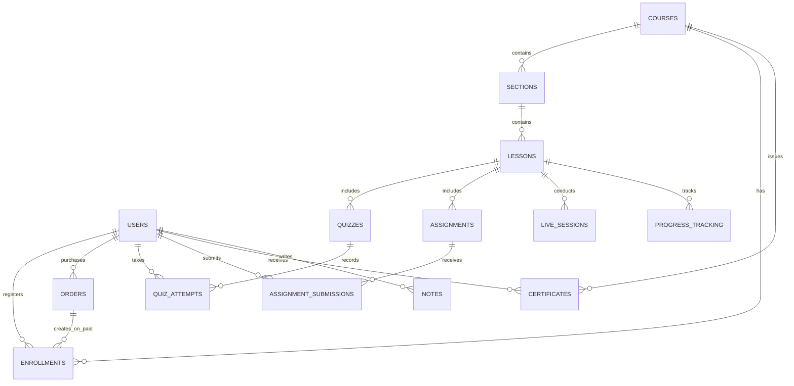

# ĐẶC TẢ CHỨC NĂNG & THIẾT KẾ KIẾN TRÚC HỆ THỐNG E-LEARNING

---

## 1. TỔNG QUAN HỆ THỐNG (SYSTEM OVERVIEW)

### 1.1. Mục tiêu & Định vị sản phẩm
Hệ thống là một nền tảng Đào tạo Trực tuyến (E-Learning LMS) thế hệ mới, phục vụ cả học viên cá nhân và các tổ chức/doanh nghiệp. Nền tảng giải quyết triệt để các bài toán thường gặp của các website học trực tuyến truyền thống:
- **Trải nghiệm học tập đa dạng:** Hỗ trợ mượt mà Video chất lượng cao (HD/4K), tài liệu PDF, slide tương tác SCORM 1.2/2004 và lớp học ảo (Live Session).
- **Bảo vệ quyền tác giả (Anti-piracy):** Cơ chế chống chia sẻ tài khoản và chống quay lén video bài giảng.
- **Tự động hóa tối đa (Zero-touch):** Thanh toán kích hoạt khóa học tức thì qua VietQR/VNPAY/MoMo, điểm danh lớp học Live tự động qua Webhook và cấp chứng chỉ số có mã QR tra cứu công khai.
- **Tiến độ học tập liền mạch:** Quy trình chấm bài tập tự luận không gây nghẽn lộ trình học của học viên.

### 1.2. Các chỉ số chất lượng dịch vụ (Non-Functional Requirements - NFRs)
- **Độ sẵn sàng (High Availability):** Đạt tối thiểu $99.9\%$ uptime.
- **Tốc độ phản hồi (Latency):** Tải trang và khởi phát video $\le 1.5$ giây thông qua mạng phân phối nội dung (CDN).
- **Khả năng mở rộng (Scalability):** Thiết kế theo mô hình Stateless Backend, dễ dàng scale để chịu tải đồng thời từ $5.000$ đến $20.000$ người dùng đồng thời (CCU).

---

## 2. MÔ HÌNH PHÂN QUYỀN VAI TRÒ (ROLE-BASED ACCESS CONTROL - RBAC)

Hệ thống phân tách rành mạch 4 vai trò chính:

| Nhóm chức năng | Super Admin | Giảng viên (Instructor) | Trợ giảng (Teaching Assistant) | Học viên (Student) |
| :--- | :---: | :---: | :---: | :---: |
| **Cấu hình hệ thống & Cổng thanh toán** | Toàn quyền | ❌ | ❌ | ❌ |
| **Kiểm duyệt & Xuất bản khóa học** | Phê duyệt | Chỉ tạo & gửi duyệt | ❌ | ❌ |
| **Tạo/Chỉnh sửa bài giảng, Đề thi** | Toàn quyền | Khóa của mình | ❌ | ❌ |
| **Lên lịch Lớp học trực tuyến (Live)** | Toàn quyền | Khóa của mình | ❌ | Tham gia |
| **Chấm bài tự luận (Grading Queue)** | Có | Khóa của mình | Khóa được phân công | Nộp bài |
| **Trả lời hỏi đáp (Q&A Desk)** | Có | Có (Ưu tiên) | Có (Hỗ trợ chính) | Đặt câu hỏi / Trao đổi |
| **Báo cáo Doanh thu & Tài chính** | Toàn sàn | Khóa cá nhân | ❌ | Xem lịch sử mua |
| **Cấp phát & Thu hồi chứng chỉ** | Toàn quyền | Xem danh sách | ❌ | Nhận & Chia sẻ |

---

## 3. ĐẶC TẢ CÁC MODULE CHỨC NĂNG CỐT LÕI

### 3.1. Module Xác thực & Onboarding (Auth & Profile)
- **Đa phương thức đăng nhập:** Đăng nhập truyền thống qua Email/Mật khẩu và Single Sign-On (Google OAuth 2.0, Apple Sign-In).
- **Bảo mật phiên duy nhất (Single Active Session):** Mỗi tài khoản chỉ được phép xem video học tập trên 01 thiết bị duy nhất tại một thời điểm; tự động ngắt kết nối thiết bị cũ khi đăng nhập trên thiết bị mới để chống dùng chung tài khoản.
- **Trắc nghiệm phân loại & Khảo sát mục tiêu:** Đề xuất lộ trình học tập cá nhân hóa ngay sau khi học viên đăng ký thành công.

### 3.2. Module Thương mại & Thanh toán Tự động (E-Commerce & Checkout)
- **Landing Page Khóa học:** Giới thiệu đề cương bài học, giảng viên, và tính năng **"Xem thử miễn phí" (Free Preview)** cho các video mẫu.
- **Giỏ hàng & Khuyến mãi:** Quản lý mã giảm giá (Coupon Code), giới hạn số lượt sử dụng và thời hạn áp dụng.
- **Cổng thanh toán không chạm (Zero-touch):**
  - **VietQR / SePay:** Sinh mã QR động kèm số tiền và mã đơn hàng duy nhất.
  - **VNPAY / MoMo / Thẻ quốc tế.**
- **Kích hoạt tự động qua Webhook:** Đối soát chữ ký số HMAC-SHA256, chuyển trạng thái đơn hàng sang `PAID` và tạo quyền ghi danh (`Enrollment`) tự động trong vòng 3-5 giây mà không cần nhân viên duyệt tay.

### 3.3. Module Học tập Đa phương tiện & Lưu vết Tiến độ
- **Trình phát Video HLS cao cấp:**
  - Hỗ trợ Adaptive Bitrate (tự động điều chỉnh 360p, 720p, 1080p, 2K theo đường truyền mạng).
  - Cấp Signed URL bảo mật có hạn dùng 10 phút.
  - **Dynamic Watermarking:** Chạy chữ mờ thông tin Email và SĐT của học viên ngẫu nhiên trên khung hình video để triệt tiêu nạn quay lén màn hình.
  - Chế độ cấm tua nhanh (Strict Mode) đối với các bài học bắt buộc.
- **Tài liệu PDF tích hợp:** Đọc trực tiếp trên Web, ẩn nút tải về đối với tài liệu bảo mật.
- **Bài giảng tương tác SCORM:** Giao tiếp hai chiều với SCORM API (1.2 và 2004) để ghi nhận kết quả tương tác bài giảng.
- **Lưu vết (Bookmarking Heartbeat):** Gửi vị trí học mỗi 10 giây; tự động gợi ý học viên tiếp tục xem đoạn dang dở khi vào lại.

### 3.4. Module Kiểm tra, Đánh giá & Chấm điểm (Assessment)
- **Trắc nghiệm trực tuyến (Quiz):**
  - Ngân hàng câu hỏi (Question Bank), xáo trộn câu hỏi và đáp án ngẫu nhiên.
  - Đồng hồ đếm ngược (Countdown Timer) và cơ chế tự động nộp bài khi hết giờ.
  - Chấm điểm tự động trong 1 giây kèm bảng giải thích đáp án chi tiết.
  - Giới hạn số lượt thi lại và quy định thời gian nghỉ (Cooldown) giữa các lần thi.
- **Bài tập nộp file (Assignment):**
  - Giới hạn định dạng (`.pdf`, `.docx`, `.zip`) và dung lượng ($\le 25\text{ MB}$), tự động quét mã độc.
  - **Cơ chế không tắc nghẽn (Non-blocking):** Học viên được tiếp tục học các bài sau trong thời gian chờ Giảng viên chấm điểm.
  - Bảng tiêu chí chấm điểm (Rubric) chi tiết cho Giảng viên và Trợ giảng.

### 3.5. Module Lớp học Trực tuyến (Live Session)
- **Tích hợp Zoom Server-to-Server OAuth & Web SDK:** Cho phép giảng viên tạo phòng tự động từ LMS và học viên học trực tiếp ngay trên giao diện web hoặc qua Zoom App.
- **Nhắc hẹn tự động:** Gửi thông báo và email trước 24 giờ và trước 15 phút kèm link phòng học; hỗ trợ đồng bộ Google Calendar.
- **Điểm danh tự động qua Webhook:** Bắt sự kiện `participant_joined` và `participant_left` của Zoom để tính chính xác tổng số phút học viên có mặt; tự động cộng điểm chuyên cần khi tham gia $\ge 60\%$ thời lượng.
- **Lưu trữ bản ghi đám mây (Cloud Recording):** Tự động liên kết video xem lại của buổi Live vào danh sách bài học để học viên ôn tập hoặc học bù khi vắng mặt.

### 3.6. Module Cấp phát & Tra cứu Chứng chỉ (Certification)
- **Điều kiện tốt nghiệp toàn diện:** Đạt 100% bài giảng, hoàn thành bài tập nộp, đạt chuẩn chuyên cần Live và vượt qua bài thi tốt nghiệp cuối khóa.
- **Chứng chỉ điện tử chống giả:**
  - Render file PDF vector độ nét cao 300 DPI kèm chữ ký số và con dấu điện tử.
  - Mã định danh chứng chỉ độc nhất (`CERT-YYYY-XXXXX`).
  - Mã QR động trỏ về trang web tra cứu công khai: `domain.com/verify/[CERT_ID]`.
- **Lan tỏa thành tích:** Nút 1-Click thêm chứng chỉ vào hồ sơ **LinkedIn**, chia sẻ lên mạng xã hội.
- **Quy trình thu hồi (Revocation):** Cho phép Admin hủy bỏ chứng chỉ vi phạm; trang tra cứu sẽ hiển thị cảnh báo đỏ khi phát hiện chứng chỉ bị thu hồi.

### 3.7. Module Tương tác & Thông báo (Community & Notification)
- **Ghi chú cá nhân gắn mốc thời gian:** Bấm vào ghi chú để tua video về đúng giây đã ghi chép; hỗ trợ xuất file PDF ghi chú.
- **Hỏi đáp bài giảng (Q&A):** Gợi ý câu hỏi tương tự có sẵn, giảng viên đánh dấu câu trả lời chính thức, gửi thông báo đẩy qua chuông web và email.

---

## 4. THIẾT KẾ KIẾN TRÚC KỸ THUẬT & HẠ TẦNG HIỆN ĐẠI

### 4.1. Đánh giá & Khắc phục hạn chế của hạ tầng VPS truyền thống
*Trong tài liệu sơ bộ cũ, phương án dùng máy chủ VPS (AZDIGI, Mắt Bão...) bộc lộ các nhược điểm nghiêm trọng khi triển khai thực tế:*
- **Nghẽn băng thông và I/O:** Khi có hàng trăm học viên cùng xem video HD/4K, ổ cứng và băng thông của VPS thông thường sẽ bị nghẽn (I/O Bottleneck), gây giật lag và đứng hình.
- **Quá tải tài nguyên khi nén video:** Quá trình chuyển đổi định dạng (Transcoding) video 4K sang nhiều độ phân giải HLS ngốn toàn bộ CPU của VPS, làm treo website chính.
- **Khó triển khai DRM/Watermark:** Tự dựng máy chủ stream video yêu cầu bảo trì phức tạp và chi phí máy chủ lớn.

### 4.2. Sơ đồ Kiến trúc Đề xuất (Production-Grade Architecture)

```
                            [ NGƯỜI DÙNG ]
                    (Web Browser / Mobile App)
                                │
                                ▼
         ┌──────────────────────────────────────────────┐
         │          CLOUDFLARE EDGE NETWORK             │
         │  - Anycast CDN (Cache hình ảnh, css, js)     │
         │  - DDoS Protection & Web Application Firewall│
         │  - SSL/TLS Termination                      │
         └──────────────────────┬───────────────────────┘
                                │
          ┌─────────────────────┴───────────────────────┐
          │                                             │
          ▼                                             ▼
┌───────────────────────────────┐       ┌───────────────────────────────┐
│     BACKEND API CLUSTER       │       │    VIDEO STREAMING PAAS       │
│  - NestJS / Go / FastAPI      │       │  - Bunny Stream / Cloudflare  │
│  - Stateless REST & GraphQL   │       │  - Tự động nén HLS 360p-1080p │
│  - WebSocket (Thông báo, Chat)│       │  - Dynamic Watermarking       │
│  - Docker / Kubernetes        │       │  - Signed Token URLs (10p)    │
└─────────┬──────────────┬──────┘       └───────────────────────────────┘
          │              │
          ▼              ▼
┌──────────────────┐ ┌──────────────────┐       ┌───────────────────────────────┐
│ POSTGRESQL CLOUD │ │   REDIS CLUSTER  │       │     OBJECT STORAGE (S3/R2)    │
│ - Dữ liệu chính  │ │ - Cache Session  │       │ - File bài tập nộp (.docx/zip)│
│ - Khóa học, User │ │ - Bookmarking    │       │ - Bản chứng chỉ PDF 300 DPI   │
│ - Đơn hàng, Điểm │ │ - Queue & Worker │       │ - Gói bài giảng SCORM         │
└──────────────────┘ └──────────────────┘       └───────────────────────────────┘
          │
          ▼
┌───────────────────────────────────────────────────────────────────────────────┐
│                         DỊCH VỤ TÍCH HỢP BÊN THỨ 3                            │
│  - Live Video: Zoom Meeting API (Server-to-Server OAuth) & Zoom Web SDK       │
│  - Cổng thanh toán: VietQR / SePay (Chuyển khoản QR), VNPAY, MoMo             │
│  - Transactional Email: Resend / SendGrid (Gửi OTP, Hóa đơn, Nhắc lịch Live)   │
└───────────────────────────────────────────────────────────────────────────────┘
```

---

## 5. THIẾT KẾ CƠ SỞ DỮ LIỆU TỔNG QUAN (CORE ERD)



---

## 6. CHIẾN LƯỢC BẢO MẬT & CHỐNG VI PHẠM BẢN QUYỀN (ANTI-PIRACY)

1. **Bảo vệ nội dung Video:**
   - **Mã hóa HLS:** Chia nhỏ video thành các đoạn mã hóa `.ts` ngắn, chỉ có thể giải mã bằng khóa phiên động.
   - **Signed URLs:** Mỗi link phát video chỉ có hạn dùng tối đa 10 phút, ngăn chặn việc sao chép link phát tán ra ngoài.
   - **Dynamic Watermark:** Chữ mờ chứa Email/SĐT học viên trôi ngẫu nhiên trên màn hình, vô hiệu hóa hoàn toàn việc dùng điện thoại hoặc phần mềm quay trộm để bán lậu.
2. **Kiểm soát phiên đăng nhập:**
   - Sử dụng Redis quản lý `Session Store`: Mỗi tài khoản chỉ có 01 phiên hoạt động duy nhất. Khi phát hiện phiên mới, phiên cũ lập tức bị vô hiệu hóa.
3. **An toàn dữ liệu bài nộp:**
   - Mọi file tải lên đều được lưu tại Cloudflare R2 / AWS S3 riêng biệt, không cấp quyền truy cập công khai trực tiếp. Giảng viên xem bài thông qua Pre-signed URL có thời hạn ngắn.

---
*Tài liệu đặc tả hệ thống phiên bản 2.0 - Hoàn thiện dựa trên 8 User Flows chuẩn hóa.*
